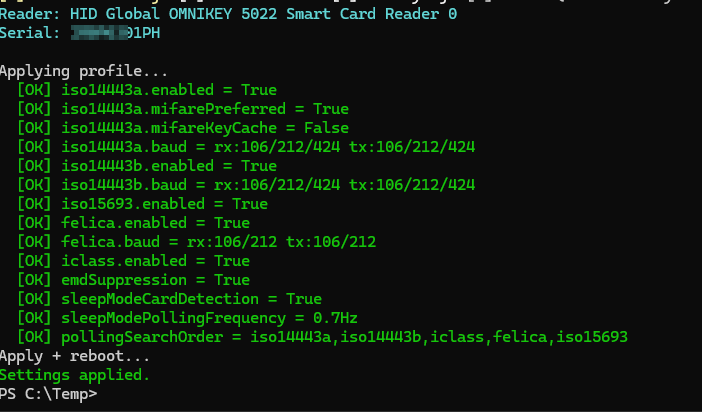

# OMNIKEY Provisioning Toolkit

[](https://github.com/franekSoftSF/omnikey-provisioning-toolkit/actions/workflows/ci.yml)

**Scripted configuration, audit and mass provisioning of HID OMNIKEY® smart card readers** (currently: **OMNIKEY 5022** contactless and **OMNIKEY 3121** contact readers; protocol-compatible with the AViatoR family — 5122/5422) —
no Workbench GUI required. Built around a real deployment across a large fleet for a banking-sector customer,
with the key use case of enabling **MIFARE Classic emulation support (`mifarePreferred`)** on
dual-interface cards.

Pure PowerShell, zero external dependencies (raw `winscard.dll` P/Invoke). Works with the reader
alone — no smart card needed, except for the card test mode.

> **Disclaimer:** independent tool, not affiliated with or endorsed by HID Global.
> OMNIKEY® is a trademark of HID Global / ASSA ABLOY AB. All proprietary APDUs used here come from
> HID's official public samples: [hidglobal/HID-OMNIKEY-Sample-Codes](https://github.com/hidglobal/HID-OMNIKEY-Sample-Codes).
> Test on a small batch before any full rollout. Use at your own risk.

---

## Features

- **One entry point** — `.\Omnikey.ps1 <command>` for everything below, or an interactive menu
  when started without a command; the original scripts keep working unchanged
- **Reader model detection** — the reader reports its model; the toolkit only writes parameters
  that model supports and never writes to unknown models (`readers` lists what is connected)
- **Get** — dump the full configuration of a connected reader (contactless slot and/or contact slot)
- **Set** — apply a JSON profile (write → Apply → reader reboot); the profile is validated first
- **Verify** — audit the reader against a profile; exit code for pipelines (`0`/`2`)
- **Export** — snapshot the current reader configuration as a Batch-ready profile
  ("golden unit" workflow)
- **TestCard** — present a card, get its ATR/UID, identification (MIFARE Classic 1K/4K,
  Plus SL1/SL2, Ultralight, CPU/T=CL…) and a clear verdict whether the reader sees it as
  **MIFARE Classic**; optional `-Loop` mode for testing a whole stack of cards
- **Batch provisioning station** — powered-USB-hub workflow for hundreds/thousands of units:
  auto-detects batches, applies the profile, verifies by serial number after reboot,
  beeps PASS/FAIL, writes a per-unit CSV audit trail, fully resumable
- Messages in **English** (default) or **Polish** (`-Lang pl`)

## Repository layout

```
omnikey-provisioning-toolkit/
├── README.md
├── LICENSE                          # MIT
├── .gitignore                       # keeps CSV logs & customer profiles out of git
├── Omnikey.ps1                      # one entry point: get/set/verify/export/testcard/batch/readers
├── CheckProfile5022.ps1             # single-reader tool (compatibility wrapper, same CLI as v1.0)
├── Batch-Omnikey5022-Provision.ps1  # mass provisioning station (compatibility wrapper)
├── OmnikeyToolkit/                  # PowerShell module with the implementation
│   ├── OmnikeyToolkit.psd1 / .psm1
│   ├── Private/                     # transport, APDUs, models, profiles, engine, cards, batch
│   └── Public/                      # Invoke-OmnikeyCli / -Tool / -Batch
├── profiles/
│   └── example-profile.json
└── tests/                           # Pester 5 suite (no hardware needed)
```

## Requirements

- Windows 10/11, PowerShell 5.1+ (also works on PowerShell 7)
- Smart Card service (`SCardSvr`)
- A supported reader (the model is detected from what the reader reports):

  | Model | What the toolkit configures | Status |
  |---|---|---|
  | OMNIKEY **5022** | contactless slot (all profile keys except `contactSlot`) | verified on hardware, used at scale |
  | OMNIKEY **3121** | contact slot (`contactSlot`) | verified on hardware (enumerates as "OMNIKEY 3x21"; no serial number) |
  | OMNIKEY 5422 / 5122 | contactless slot without 15693 / FeliCa / polling order, plus contact slot | per HID's sample code, **not yet verified on hardware** |
  | any other reader | nothing — `get`/`verify` read only | configuration changes are blocked |

- Driver, one of:
  - **HID OMNIKEY CCID Driver** v2.3.4+ (recommended; escape commands work out of the box) —
    [hidglobal.com/drivers](https://www.hidglobal.com/drivers); for mass rollout deploy the INF via
    `pnputil /add-driver <inf> /install`
  - Microsoft inbox CCID driver **with escape commands enabled**:
    `EscapeCommandEnable=1` (DWORD) under the device's `Device Parameters`, then replug

First run on a fresh machine:

```powershell
Set-ExecutionPolicy -Scope CurrentUser RemoteSigned
Get-ChildItem -Recurse -File | Unblock-File      # in the unpacked folder: scripts AND OmnikeyToolkit\
```

Close Workbench before using the tools — it holds the reader and DIRECT connect will fail.

---

## One entry point: `Omnikey.ps1`

```powershell
.\Omnikey.ps1 readers                                            # what is connected and what can be configured
.\Omnikey.ps1 get                                                # dump configuration
.\Omnikey.ps1 export   -OutProfile .\my-profile.json             # reader -> profile JSON
.\Omnikey.ps1 set      -ProfilePath .\my-profile.json            # profile -> reader (+reboot)
.\Omnikey.ps1 verify   -ProfilePath .\my-profile.json            # audit, exit 0=PASS 2=FAIL
.\Omnikey.ps1 testcard [-Loop]                                   # card test
.\Omnikey.ps1 batch    -ProfilePath .\my-profile.json -LogCsv .\prov.csv
.\Omnikey.ps1                                                    # interactive menu
```

```
HID Global OMNIKEY 3x21 Smart Card Reader 0
    model: OMNIKEY 3121  fw: 1.6.0  serial: ?
    contactless slot: no  contact slot: yes  configuration: supported
HID Global OMNIKEY 5022 Smart Card Reader 0
    model: OMNIKEY 5022  fw: 2.0.0  serial: EXAMPLE0001
    contactless slot: yes  contact slot: no  configuration: supported
```

- Without `-ReaderMatch` the single connected OMNIKEY reader is used; with several readers the
  command stops and lists them. `-ReaderMatch` takes a regex on the PC/SC reader name **or a model
  number** (`-ReaderMatch 3121` finds "OMNIKEY 3x21"). `batch` uses all OMNIKEY readers by default.
- Parameters are the same as in the scripts below (`-ProfilePath` also accepts `-Profile`);
  a parameter that does not belong to the command (e.g. `get -Loop`) is an error.
- `-Lang pl` for Polish messages, exit codes as in [Exit codes](#exit-codes).

## Single-reader tool: `CheckProfile5022.ps1`

Kept with exactly the v1.0 command line (`Omnikey.ps1` runs the same code):

```powershell
.\CheckProfile5022.ps1 -Mode Get                                        # dump configuration
.\CheckProfile5022.ps1 -Mode Export -OutProfile .\my-profile.json       # reader -> profile JSON
.\CheckProfile5022.ps1 -Mode Set    -Profile .\my-profile.json          # profile -> reader (+reboot)
.\CheckProfile5022.ps1 -Mode Verify -Profile .\my-profile.json          # audit, exit 0=PASS 2=FAIL
.\CheckProfile5022.ps1 -Mode TestCard                                   # single card test
.\CheckProfile5022.ps1 -Mode TestCard -Loop                             # test a stack of cards
```



*`Set` mode: every profile parameter confirmed, then Apply + reader reboot.*

Common parameters: `-Lang en|pl`, `-ReaderMatch <regex>` (default `5022`),
`-CardTimeout <s>` (TestCard), `-NoReboot` (Set).

### Card test (`TestCard`)

Reads the card's PC/SC ATR and UID, identifies the technology and gives a verdict:

```
Reader mifarePreferred: ENABLED
Present a card on the reader (waiting up to 30s)...
ATR: 3B8F8001804F0CA000000306030001000000006A
UID: 04A1B2C3D4E5F6
Card identified as: MIFARE Classic 1K
VERDICT: reader sees this card as MIFARE CLASSIC - emulation/native Classic WORKS for this card.
```

The verdict is **context-aware**: if the card presents as a CPU card, the tool tells you whether
that is expected (`mifarePreferred` disabled — enable and retest) or meaningful
(`mifarePreferred` enabled — this card exposes no Classic emulation).

`-Loop` tests cards one after another: double beep = Classic, low beep = other,
waits for card removal between cards, `Ctrl+C` ends with a summary
(`Cards tested: 12 | MIFARE Classic: 11 | other: 1`).

Recognised storage types: MIFARE Classic 1K/4K, Mini, Plus SL1 2K/4K (Classic mode),
Plus SL2 2K/4K, Ultralight, Ultralight C, Topaz/Jewel, FeliCa; anything else is shown with its
raw PC/SC code. Note: PC/SC cannot distinguish *native* Classic from a *dual-interface emulation* —
to tell them apart, test the same card with `mifarePreferred` off (emulated cards flip to CPU,
native Classic stays Classic).

On a contact reader (OMNIKEY 3121) `TestCard` shows the ATR and protocol of the inserted card
(`Card identified as: contact smart card (ISO 7816), protocol T=1`) and exits `0` when the card answers.

---

## Profile reference

A profile is a JSON file. **Every key is optional** — only listed keys are set/verified,
everything else on the reader is left untouched. `Export` produces a full snapshot; delete keys
you don't want to enforce.

Profiles are **validated before anything is sent**: unknown keys (typos such as `mifarePrefered`),
non-boolean values, unsupported bit rates or voltages and keys the connected model does not support
stop with a clear message and exit code `1`. Keys starting with `_` are ignored (use them for notes).

```json
{
  "iso14443a": {
    "enabled": true,
    "mifarePreferred": true,
    "mifareKeyCache": false,
    "rx": [212, 424],
    "tx": [212, 424]
  },
  "iso14443b": { "enabled": true, "rx": [212, 424], "tx": [212, 424] },
  "iso15693":  { "enabled": true },
  "felica":    { "enabled": true, "rx": [212], "tx": [212] },
  "iclass":    { "enabled": true },
  "emdSuppression": true,
  "sleepModeCardDetection": true,
  "sleepModePollingFrequency": "0.7Hz",
  "pollingSearchOrder": ["iso14443a", "iso14443b", "iclass", "felica", "iso15693"]
}
```

| Profile key | Workbench equivalent | Values | Description |
|---|---|---|---|
| `iso14443a.enabled` | ISO14443A → Enabled | `true`/`false` | Polling for ISO/IEC 14443 Type A (MIFARE family). |
| `iso14443a.mifarePreferred` | **MIFARE emulation preferred** | `true`/`false` | Dual-interface cards exposing a MIFARE Classic emulation (e.g. CardOS DI) are presented as **MIFARE Classic** instead of a CPU card. The key setting of this toolkit. |
| `iso14443a.mifareKeyCache` | MIFARE key cache enabled | `true`/`false` | Cache MIFARE keys in the reader between card sessions. |
| `iso14443a.rx` / `.tx` | Rx/Tx Baud Rates | `212`,`424`,`848` | Extra bit rates (kbps). **106 is always on** — do not list it. |
| `iso14443b.enabled` + `rx/tx` | ISO14443B | as above | ISO/IEC 14443 Type B. |
| `iso15693.enabled` | ISO15693 | `true`/`false` | ISO/IEC 15693 vicinity cards. |
| `felica.enabled` + `rx/tx` | Felica | `212`,`424` | FeliCa. |
| `iclass.enabled` | iClass | `true`/`false` | HID iCLASS credentials. |
| `emdSuppression` | EMD Suppression | `true`/`false` | Filters spurious detections; recommended `true`. |
| `sleepModeCardDetection` | Sleep Mode Card Detection | `true`/`false` | Card detection during low-power sleep. |
| `sleepModePollingFrequency` | Sleep Mode Polling Frequency | `41Hz` `20Hz` `10Hz` `5Hz` `2.5Hz` `1.3Hz` `0.7Hz` `0.3Hz` `0.15Hz` `0.08Hz` | Sleep polling rate (Workbench shows e.g. `0.7Hz (1.4s)`). |
| `pollingSearchOrder` | Polling Search Order | up to 5 of `iso14443a` `iso14443b` `iso15693` `iclass` `felica` `none` | Technology search order; put the production card technology first. |
| `contactSlot.enabled` | Contact Slot → Enabled | `true`/`false` | Contact (ISO 7816) slot on/off — readers with a contact slot only. |
| `contactSlot.operatingMode` | Operating Mode | `iso7816`, `emvco` | Contact card handling: ISO 7816 (ID, signature, PIV cards) or EMVCo (payment). |
| `contactSlot.voltageSequence` | Voltage Sequence | `"auto"` or 1–3 of `"5V"` `"3V"` `"1.8V"` in order | Order of card supply voltages tried at power-up. OMNIKEY 3121 does not keep `"auto"` (it reports `5V` after reboot) — list the voltages. |

Contact reader example (OMNIKEY 3121):

```json
{ "contactSlot": { "enabled": true, "operatingMode": "iso7816", "voltageSequence": ["5V", "3V", "1.8V"] } }
```

<details>
<summary><b>Under the hood: APDU map</b></summary>

All settings use HID proprietary TLV escape APDUs (`FF 70 07 6B …`) sent via `SCardControl`
with IOCTL `0x3136B0` in PC/SC **DIRECT** mode (no card required):

| Item | Tech tag | Sub-tag |
|---|---|---|
| ISO14443A enable / baud / key cache / MIFARE preferred | `A2` | `80` / `81` / `83` / `84` |
| ISO14443B enable / baud | `A3` | `80` / `81` |
| ISO15693 enable | `A4` | `80` |
| FeliCa enable / baud | `A5` | `80` / `81` |
| iCLASS enable | `A6` | `83` |
| EMD / polling order / sleep freq / sleep detection | `A0` | `87` / `89` / `8D` / `8E` |
| Serial / product name / firmware | `A0` | `92` / `82` / `85` |
| Contact / contactless slot count (model detection) | `A0` | `8B` / `8C` |
| Contact slot: voltage sequence / operating mode / enable (container `A3`) | `A0` | `82` / `83` / `85` |
| Apply settings / reboot device | `A9` | `80` / `83` |

Baud byte: `rxNibble << 4 | txNibble`; bits `212=1`, `424=2`, `848=4` (106 implicit).
Voltage sequence byte: `first | second << 2 | third << 4`; `5V=3`, `3V=2`, `1.8V=1`, `0x00` = auto.
Get responses: `BD 03 <sub> 01 <val> 90 00`; polling order: `BD 07 89 05 <5B> 90 00`.
Reference: `ContactlessSlotConfiguration.cs`, `ContactSlotConfiguration.cs`, `ReaderCapabilities.cs`
in HID's sample repo.
</details>

---

## Mass provisioning: `Batch-Omnikey5022-Provision.ps1`

Designed for an operator with a **powered** USB hub:

```powershell
.\Batch-Omnikey5022-Provision.ps1 -ProfilePath .\profiles\my-profile.json -LogCsv .\prov.csv -Lang pl
```

1. Plug a batch (8–10 readers) into the hub — the script detects it automatically
   (reader count stable for `-StableSec`, default 4 s).
2. Each unit: read **serial / product name / firmware** → check **all** profile parameters →
   already compliant? `PASS` without touching it → otherwise apply everything, `Apply`, reboot.
3. Post-reboot verification is **matched by serial number** (USB indices may shuffle).
4. Double beep = batch OK, low beep = at least one FAIL. Unplug, plug the next batch. `Ctrl+C` ends.

A unit whose model does not support every profile key (or is unknown) is logged
`FAIL;unsupported model: …` and left untouched. Batch mode needs a serial number to match units after
reboot — OMNIKEY 3121 does not report one, so configure 3121 units one at a time with `set` / `verify`.

### CSV audit trail

```
timestamp;serial;product_name;firmware;inventory_number;result;detail
2026-09-14T10:32:11;EXAMPLE0001;OMNIKEY 5022;2.0.0;;PASS;configured and verified
2026-09-14T10:33:05;EXAMPLE0002;OMNIKEY 5022;2.0.0;;PASS;already compliant
```

- `inventory_number` is left **empty for the customer** to fill in (e.g. Excel), or pre-filled
  via `-InventoryMap map.csv` (columns `serial;inventory_number`).
- The CSV is also the **resume state**: units logged `PASS` are skipped in later sessions
  (re-checked, not re-written). Start a fresh CSV when you change the profile —
  `PASS` means *compliant with the entire profile*.

### Failure diagnostics

A failed post-reboot verification logs a trace:

```
verify failed: scans:30 maxReaders:1 serialsSeen:[EXAMPLE0001] errors:[escape:0x80100017] ctxResets:2
```

- `maxReaders:0` → the unit never re-enumerated: check **hub power**, raise `-RebootWait`.
- `errors:[connect/escape:0x…]` → the unit came back but PC/SC access failed; the code points
  at driver vs timing.

---

## Recommended workflow (golden unit)

```powershell
# 1. Configure ONE reference reader (Workbench or Tool -Mode Set)
# 2. Snapshot it:
.\CheckProfile5022.ps1 -Mode Export -OutProfile .\profiles\my-profile.json
# 3. Self-test the chain (must be all-PASS):
.\CheckProfile5022.ps1 -Mode Verify -Profile .\profiles\my-profile.json
# 4. Card sanity check on the reference unit:
.\CheckProfile5022.ps1 -Mode TestCard
# 5. Run the series:
.\Batch-Omnikey5022-Provision.ps1 -ProfilePath .\profiles\my-profile.json -LogCsv .\prov.csv
# 6. Spot-check configured units with Verify / TestCard (e.g. 1 in 50).
```

Throughput note: with a 10-port powered hub, expect ~2.5–3 min per batch including handling —
roughly 200–300 units per hour of operator time on one station; physical packing dominates.

## Exit codes

| Code | Meaning |
|---|---|
| `0` | OK / audit or card-test PASS (`TestCard -Loop` always exits 0; summary on console) |
| `1` | Execution error (connection, profile, write failure, card timeout) |
| `2` | Verify / TestCard FAIL |

## Troubleshooting

| Symptom | Cause / fix |
|---|---|
| `Cannot connect in DIRECT mode` | Another app holds the reader — close **Workbench**. |
| `SCardControl 0x80100016 / escape errors` | Microsoft CCID driver without escape enabled → install the HID driver or set `EscapeCommandEnable=1` and replug. |
| Unit configured but reported FAIL after reboot | Fixed in current versions: Windows stops the Smart Card service when the last reader disappears (`SCARD_E_NO_SERVICE`); the tools now auto-recover the PC/SC context. If it persists: powered hub, `-RebootWait 15`. |
| `Add-Type: type WinSCard already exists` | Fixed: the P/Invoke type lives in its own namespace (`OmniTool`) with an idempotent guard. If you modify the P/Invoke signatures, **rename the namespace** — .NET types cannot be unloaded from a live session. |
| `... is not digitally signed` / `cannot be loaded` for a file in `OmnikeyToolkit\` | The module files of a downloaded ZIP are blocked like the scripts: run `Get-ChildItem -Recurse -File \| Unblock-File` in the unpacked folder. |
| `<key>: not supported by OMNIKEY 3121` | The profile contains keys for a slot this model does not have (e.g. contactless keys on a contact reader). Use a profile for that model — `export` one from a configured unit. |
| `Unknown profile key '...'` | Typo in the profile (keys are checked since v1.2) — the message lists the allowed keys. |
| `Several readers found` | `Omnikey.ps1` does not guess: add `-ReaderMatch 5022` / `-ReaderMatch 3121`. |
| Card shows as CPU although it "is MIFARE" | Dual-interface card + `mifarePreferred` disabled → enable and retest (`TestCard` prints this hint itself). |
| Auth test fails on customer cards | Expected: production cards don't use transport keys; it does not indicate a misconfigured reader. |

## Testing

The `tests/` folder holds a [Pester 5](https://pester.dev) suite that runs **without a reader,
a card or the Smart Card service**: every PC/SC call is mocked, readers are simulated from responses
recorded on a real OMNIKEY 5022 and 3121, and the expected APDUs are written out by hand from the
protocol notes, not taken from the module.

```powershell
Install-Module Pester -MinimumVersion 5.5.0 -MaximumVersion 5.99.99 -Scope CurrentUser -SkipPublisherCheck
Invoke-Pester ./tests -Output Detailed
```

Works on Windows PowerShell 5.1 and PowerShell 7. What is covered:

- **Profiles** (`Profile.Tests`): every key type, partial profiles, validation errors (EN/PL),
  which keys each reader model accepts
- **APDUs and parsers** (`Apdu.Tests`): builders checked against HID's sample strings, response
  parsers, baud and voltage encodings, card-type classification from the ATR
- **Engine** (`Engine.Tests`): exact SET APDUs for a profile, checks never write, Get/Export on a
  simulated 5022 and 3121, model detection, PC/SC context recovery after `SCARD_E_NO_SERVICE`
- **Console output** (`Cli.Tests`): Get / Verify / Set text compared with output recorded on
  hardware (`tests/fixtures`, serials masked), exit codes, write safety, `Omnikey.ps1` commands and menu
- **Batch** (`Batch.Tests`): unit decisions, verification matched by serial after USB reshuffle,
  diagnostics, CSV lines, resume state
- **Regressions** for the pitfalls below; **module wiring** (`Module.Tests`); **repo guards**
  (`Repo.Tests`): CLI parameters unchanged, thin wrappers, P/Invoke signatures tied to their
  namespace, EN/PL message keys in sync, LF line endings, release content

GitHub Actions runs PSScriptAnalyzer (fails on errors, reports warnings) and this suite on
Windows PowerShell 5.1 and PowerShell 7 for every push and pull request. Pushing a `vX.Y.Z` tag
builds the runtime-only ZIP and `SHA256SUMS.txt` and publishes the release
(notes from `docs/release-notes/<tag>.md`; tags with a suffix such as `-rc1` become pre-releases).

## Development notes

- All logic lives in the `OmnikeyToolkit` module; `Omnikey.ps1`, `CheckProfile5022.ps1` and
  `Batch-Omnikey5022-Provision.ps1` only import it and call `Invoke-OmnikeyCli` / `-Tool` / `-Batch`.
  Components are plain `.ps1` files listed in `OmnikeyToolkit.psm1`; only `Private/Transport.ps1`
  calls winscard, behind small `Invoke-Native*` functions that tests mock.
- Reader models are data in `Private/Models.ps1` (product name, profile keys, verified flag).
- PowerShell pitfalls this codebase already paid for — keep them in mind when contributing:
  script functions are **not visible inside `GetNewClosure()` scriptblocks**, and a scriptblock
  created **outside** the module cannot call the module's private functions (the ops engine is
  data-only and every scriptblock used by the batch station is defined inside the module);
  **empty arrays unroll to `$null`** across function boundaries (multi-value results are
  returned as hashtables).
- Windows-only (winscard P/Invoke). A Linux port would target `pcscd` + pyscard —
  all APDUs in this README apply unchanged.

## Trademark & legal notice

- This is an **independent, community-made tool**. It is **not** a product of, affiliated with,
  sponsored or endorsed by **HID Global Corporation** or **ASSA ABLOY AB**.
- **HID®, OMNIKEY® and the HID Brick logo** are trademarks or registered trademarks of
  HID Global / ASSA ABLOY AB. They are used here solely to identify hardware compatibility
  (nominative use); no affiliation is implied.
- The proprietary APDU commands used by this toolkit are taken exclusively from **information
  HID Global has published themselves** in their public sample code repository
  ([hidglobal/HID-OMNIKEY-Sample-Codes](https://github.com/hidglobal/HID-OMNIKEY-Sample-Codes)).
  No reverse engineering of drivers or firmware was performed, and no HID documentation is
  reproduced in this repository — for official documentation and screenshots, see
  [hidglobal.com](https://www.hidglobal.com).
- The **official configuration tool** for OMNIKEY readers is HID's *OMNIKEY Workbench Tool*.
  If you need vendor support or warranty coverage, use official HID channels — and report
  issues with **this** toolkit here, in this repository's issue tracker, never to HID support.
- Provided *as is*, without warranty of any kind. You are responsible for validating the
  configuration on your hardware before any production rollout.

## License

MIT — see [LICENSE](LICENSE).
